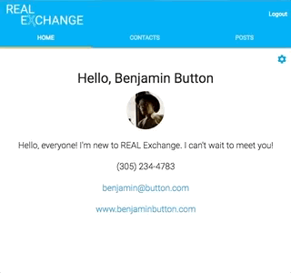

<h1 align="center" style="background-color: #03A9F4;">
   
  
</h1>

<h3 align="center">How REALTORS&reg; Connect</h3>

## Key Features

### Users

* Users can edit bios and contact information
* Users can add others to their contact list to be able to quickly contact them or view all of their posts in the future

### Posts

* Posts can be created in 3 different categories:
  - Available
  - Wanted
  - Announcement
* Photos, a title and description can be added to each users posts
* Users can comment on each others posts and choose to delete their comments later

## Credits
This software uses code from several open source packages.
* HTML5, CSS, Javascript
* Materialize
* node
* mongodb and mongoose
* Passport
* Handlebars
* webpack
* TravisCLI
* Mocha and Chai
